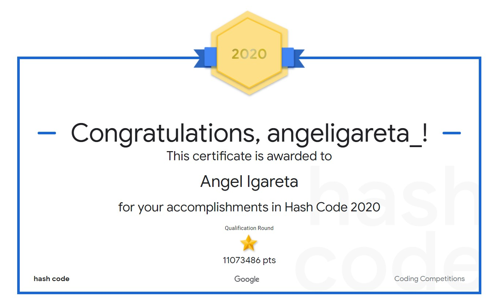

<h1 align="center">Hash Code 2020</h1>
<h4 align="center">Online qualification round of #HashCode2020, a Google programming competition to solve a team-based challenge</h4>

## Problem statement
Books allow us to discover fantasy worlds and beer understand the world we live in.
They enable us to learn about everything from photography to compilers… and of
course a good book is a great way to relax!

Google Books is a project that embraces the value books bring to our daily lives. It
aspires to bring the world's books online and make them accessible to everyone. In the
last 15 years, Google Books has collected digital copies of 40 million books in more
than 400 languages , paly by scanning books from libraries and publishers all around
the world.

In this competition problem, we will explore the challenges of seing up a scanning
process for millions of books stored in libraries around the world and having them
scanned at a scanning facility.

## Task
Given a description of libraries and books available, plan which books to scan from
which library to maximize the total score of all scanned books, taking into account that
each library needs to be signed up before it can ship books.

## Certificate

## Team
- Cristian Abrante - [LinkedIn](https://www.linkedin.com/in/cristianabrante/)
- Stefana Raileanu - [LinkedIn](https://www.linkedin.com/in/stefana-raileanu/)
- Miriam Punzi - [LinkedIn](https://www.linkedin.com/in/miriam-punzi-489a85191/)
- Angel Igareta - [LinkedIn](https://www.linkedin.com/in/angeligareta/)
